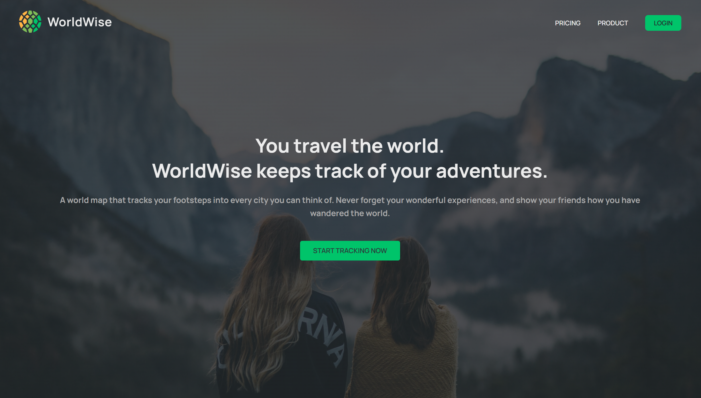
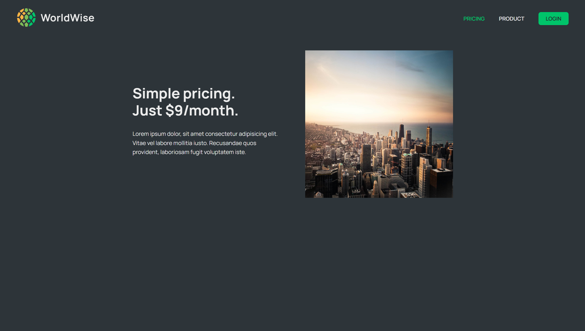
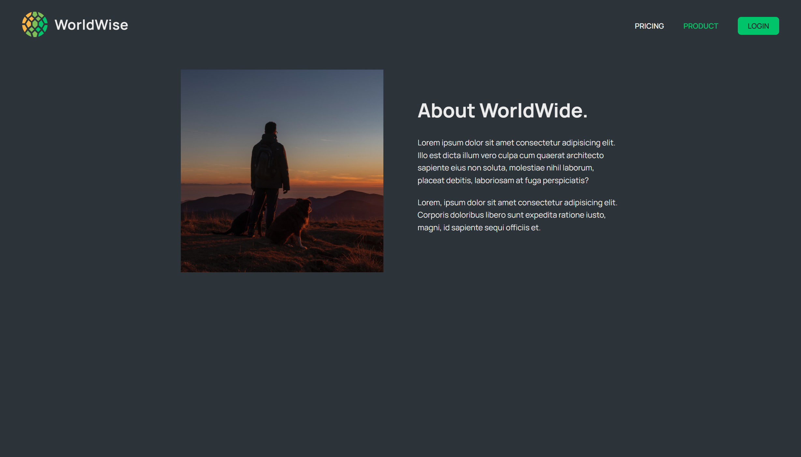
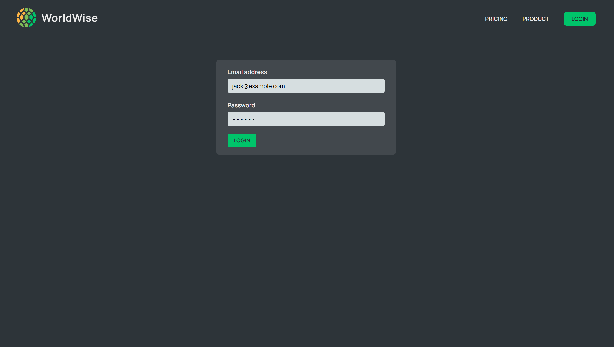
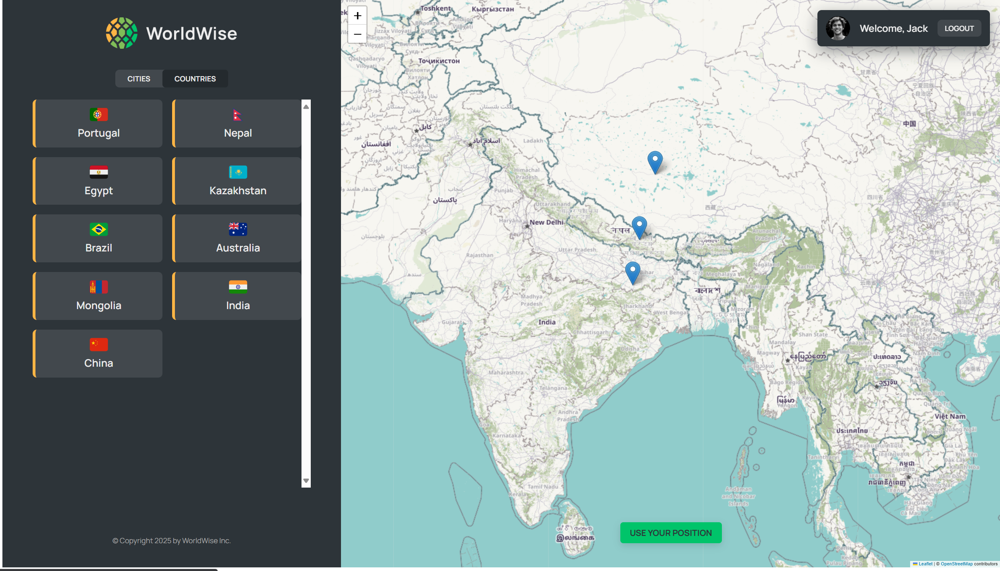

# 🌍 WorldWise

**WorldWise** is a travel companion app that allows users to explore maps, navigate locations, and track the countries and cities they have visited.

## 🌍 Live Demo

[WorldWise - Live Deployment](https://worldwise-2cx7mcavg-itisits-projects.vercel.app/)

## ✨ Features

- Interactive world map for navigation
- Save visited countries and cities
- View travel history

## 💪 Installation & Setup

To run this project locally, follow these steps:

1. Clone the repository:
   ```sh
   git clone https://github.com/it-is-it/Worldwise.git
   ```
2. Navigate to the project directory:
   ```sh
   cd worldwise
   ```
3. Install dependencies:
   ```sh
   npm install
   ```
4. Start the development server:
   ```sh
   npm run dev
   ```

- Open `http://localhost:5173` in your browser.

## 🚀 Tech Stack

- **Frontend**: React, React Router Dom, Leaflet.js (for maps), CSS3
- **Data Storage**: data.json file to store visited countries and cities
- **Deployment**: Vercel

## 🛠️ How It Works

### 🌍 App Features

- Displays pins on the map where you have traveled.
- Lists visited places with a button to center the map on your current location.
- Clicking on the map centers the view and opens a modal to add city details.
- After adding a city, it is listed among all visited locations.
- Allows deletion of visited cities.
- Clicking a city opens details and provides a link to its Wikipedia page.
- View all visited countries in a dedicated section.

## 📺 Screenshots

### Landing page



### Pricing page



### Product page



### Login page



### Cities visited page


### Countries visited page



## 🛠️ Troubleshooting

If you encounter issues during build or deployment:

- Check file imports (case-sensitive in Vercel).
- Verify `package.json` dependencies.
- Run `npm run build` locally before deploying.

## 📄 Deployment

This project is deployed using **Vercel**. To redeploy, push changes to the main branch or use:

```sh
vercel --prod
```

## 🔗 You may also like...

- **Tasty Trail** - A food ordering app
- **The Wild Oasis** - A hotel service app
- **React Quiz** - A React-based quiz app

## 📞 Contact

For support or inquiries, reach out via [LinkedIn](https://www.linkedin.com/in/ishwortimalsina) or open an issue in the repository.

## 📚 License

This project is licensed under the MIT License.

---

💡 _Explore the world, track your journeys, and make every trip memorable with WorldWise!_

**Author:** Ishwor Timalsina
